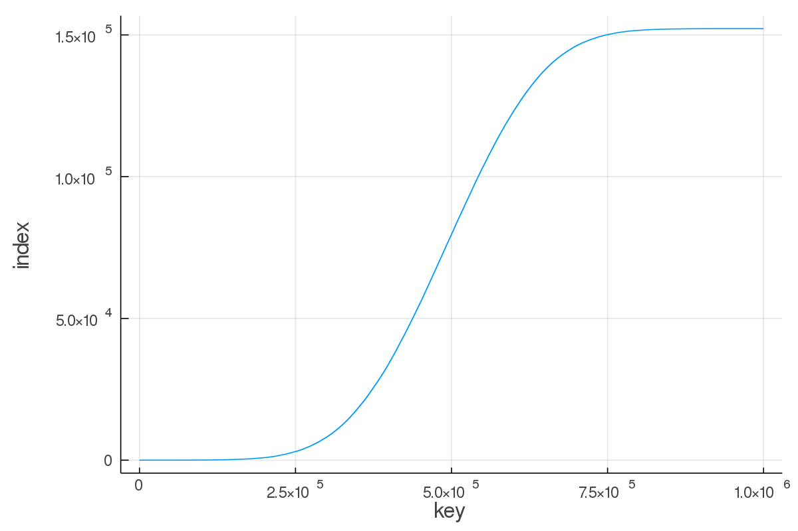
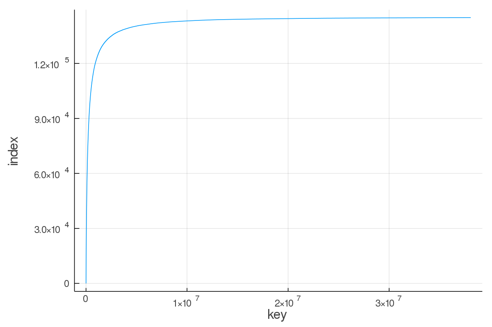
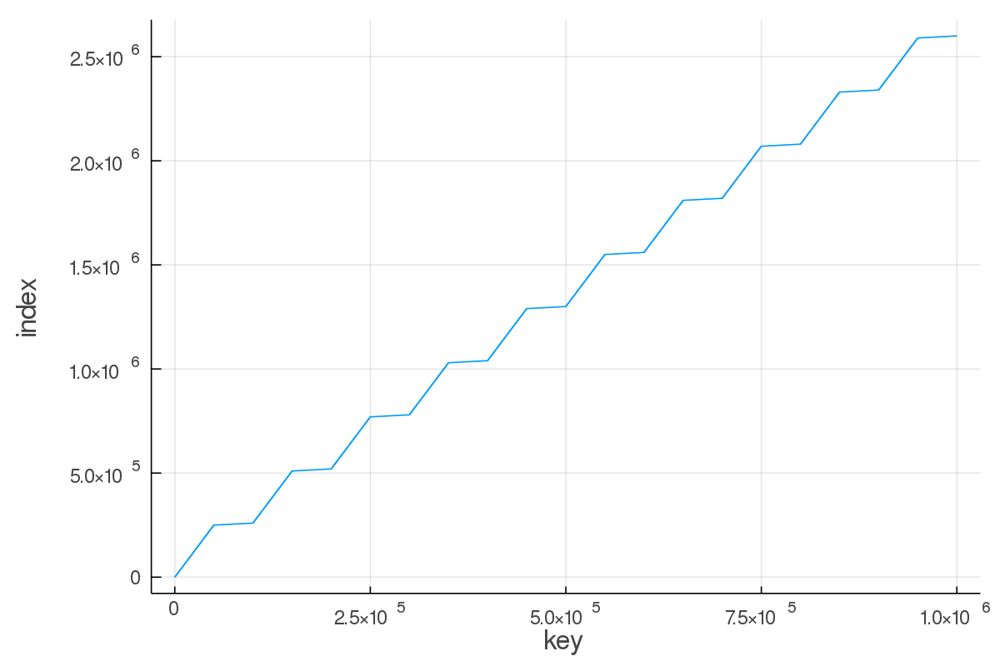
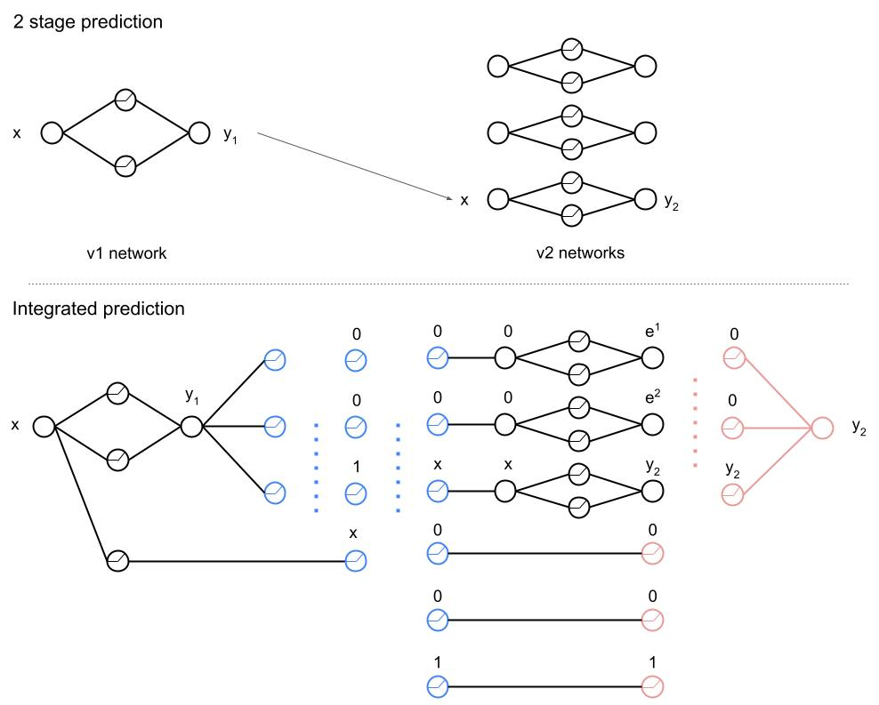

# Database Indexing Benchmark 

## Background

We propose the benchmark: verifying learned indexes of databases. The full proposal is [here](http://naizhengtan.github.io/doc/docs/nn4sys_proposal.pdf)}. We will briefly introduce this benchmark below.

Background: learned index is a neural network (NN) based database index proposed by [this paper](https://research.google/pubs/pub46518/), 2018. It has great potential but also has one drawback due to NNs---for non-existing keys (in the database), the outputs of a learned index can be arbitrary.

What we do: to tame NN's uncertainty, we design a specification to dictate how "far" one predicted position can be, compared to its actual position (or the positions that non-existing keys should be).

What to verify: our benchmark provides multiple pairs of (i) learned indexes (trained NNs) and (ii) corresponding specifications. We design these pairs with different parameters such that they cover different user needs and have varied difficulties for verification tools.

A note on broader impact: using NNs for systems is a broad topic, but many existing works lack strict safety guarantees. We believe that NN Verification can help system developers gain confidence in NNs to apply them to critical systems. We hope our benchmark can be an early step towards this vision.

### Data
In short, database indexing problem can be viewed as a one dimentional function fitting problem with high precision requirements. The function represents a data distribution and the specification usually requires the prediction error to be less than $0.01\%$ of the index scale. The verification difficulty depends on the data distribution. We will verify three different data distribution: normal, lognormal, and piecewise linear. The graphs of the distributions are shown below:

### Network
In the original paper, to meet the high precision requirement, the indexing is completed by two stages. In the first stage, we divide the index space into N pieces. A network called v1-network predicts the index of the key roughly such that we know in which piece the index locates. Then in the second state, the corresponding v2-network that is specifically trained for this piece predicts the acurate index of the key. 

However, it is inconvenient to verify because there is a "switch" operation, which is to choose the v2-network based on the prediction of v1-network. Therefore, we merge the v1-network and N v2-network into a integrated network by some hand crafted layers as shown in the illustration:

Denote the key by $x$ and the index $y$. We divide the index space into 3 pieces and train 3 v2-networks. Suppose the output $y_1$ of v1-network lies in the third piece, then we feed $x$ into the third v2-network to get $y_2$, 

To merge the two steps into one, we first add several converter layers, which are denoted by blue nodes. The converter converts the output of the v1-network into an input vector for v2-networks and a mask vector. The mask vector will be used in the end to mask out noises. There is noise because even the input of a v2-network is 0, its output may not be zero due to biases.

In this benchmark, the v1-network is a 5 layer fully connected network, with 100 neurons each hidden layer. We consider two different settings for the v2-network. 1. N=100, each v2-network is 2 layer fully connected network, with 600 neurons in the hidden layer. 2. N=1000, each v2-network is 2 layer fully connected network, with 6 neurons in the hidden layer. All the layers use ReLU activation except the last layer.

## Verification instruction

There are three folders: normal, lognormal, and piecewise. Each folder contains 3 instance files, and each file has a time limit less tahn 20 mins in total to verify all the specifications. Each specification contains a short range of the key and a short range of the index. We need to verify whether the output of the network for the given key range falls in the given index range.